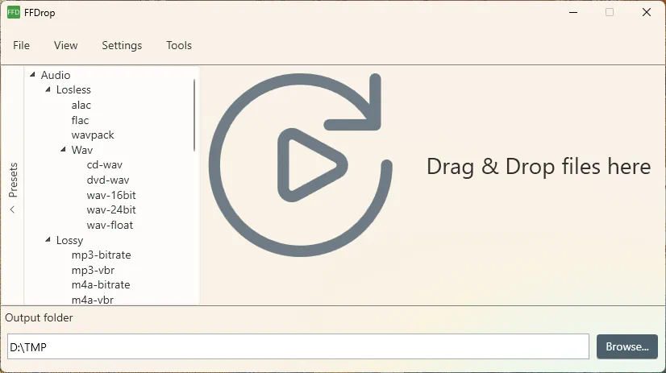

# FFDrop

FFDrop is a preset-based FFmpeg frontend that allows you to convert media files by simply dragging and dropping them onto the application. It is designed to be user-friendly and efficient, making media conversion tasks straightforward.

## Features

* Preset based conversion options that can be easily extended and configured in a json file.
* Is able to download & install FFmpeg from github releases

## Requirements

The application uses .NET 9 & WPF, so any Windows that is supported by .NET 9 should work. The FFmpeg download and install feature is hardcored currently to x64.